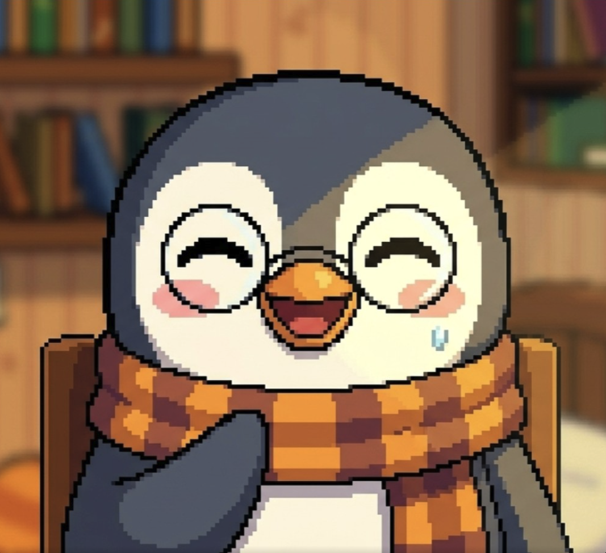

# Same Bestie

**A gentle focus companion designed to make showing up feel personal.**



## The idea

Same Bestie turns focus sessions, check-ins, and small daily wins into a relationship with a digital companion. The product replaces the cold language of productivity dashboards with encouragement, ritual, and visible emotional progress.

The experience is built around a simple promise: consistency should feel supported, not judged.

## Creative direction

The product explores two connected visual worlds. The original system uses a deep nocturnal palette, pixel and retro-computing references, lavender, mint, and coral signals, glowing cards, and a character-led interface. A second direction introduces warmer paper surfaces, grain, softer layers, and a more tactile journal quality.

Across both, the companion remains the emotional center and data stays legible without becoming clinical.

## Product experience

- onboarding and intention setting
- focus sessions and ambient sound
- emotional check-ins
- progress summaries and streaks
- companion reactions and encouragement
- statistics presented as supportive feedback
- responsive mobile and web experience

## Role

Creative direction, product concept, character-led experience, visual system, interaction design, and implementation by [Tata Portal](https://tataportal.xyz).

## Technology

Expo, React Native, TypeScript, Expo Router, Zustand, local storage, notifications, haptics, audio, video, and React Native Web.

## Run locally

```bash
npm install
npm start
```
